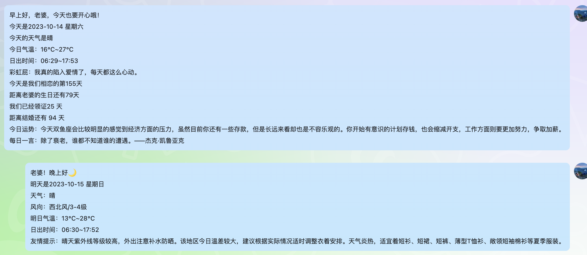

### QQ消息推送
`定时推送消息到指定QQ`

### 请修改application.yml中的配置
```yaml
bot:
  # 机器人QQ号
  qq: 1718018032
  # 老婆的QQ
  wifeQQ: 1718018032
push:
  # 老婆的生日，需要写明年的日子，下次更新将修改为出生日子自动计算
  birthday: 1990-01-01
  # 恋爱纪念日
  fallingInLove: 1990-01-01
  # 认识的日子
  acquaintance: 1990-01-01
  # 订婚的日子
  engagement: 1990-01-01
  # 领证的日子，自动判断是倒计时还是统计天数
  obtainingACertificate: 1990-01-01


# 获取彩虹屁和天气的接口Key https://www.tianapi.com/
tianxing:
  key: xxxxxxxxxxxxxxxxxxxxxxxxxxxxxxxx
```

系统会在启动推送早上/晚上的消息，早上定时为7.15，晚上为21.15，此时间在`com.yuxuan66.wife.task.MorningPush`中修改

### 项目启动
项目采用SpringBoot打包，参考如下启动方式
```shell
mvn package
java -jar wifePush.jar
# linux下后台启动
nohup java -jar wifePush.jar > wifePush.log 2>&1 &
# 不需要日志文件
nohup java -jar wifePush.jar > /dev/null 2>&1 &
```

### 推送效果参考

